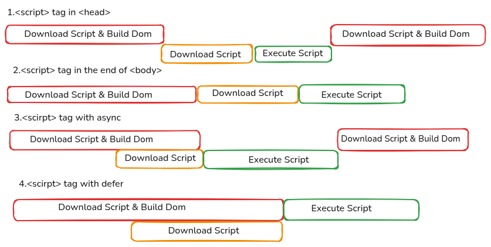

# 40 Days JavaScript Fundamental Crash Course

## 🚀 JavaScript Introduction

### JavaScript is a high-level, versatile programming language used to create interactive and dynamic web applications. Along with HTML and CSS, it is one of the core technologies of the web.

```
HTML → Structure
CSS → Styling
JavaScript → Functionality
```

### JavaScript allows developers to:
1. Handle user interactions (click, input, scroll)
2. Manipulate the DOM (update content dynamically)
3. Build interactive UI components
4. Work with APIs and fetch data
5. Create full-stack applications

### It runs directly in the browser using engines like Google Chrome V8 and can also run on the server using Node.js.

## 💡 Why Learn JavaScript?
1. 🌍 Most popular language for web development
2. ⚡ Fast and runs in all modern browsers
3. 🔥 Required for frontend, backend, and full-stack development
4. 📦 Huge ecosystem (React, Node, Express, etc.)
5. 🎯 Goal of This Journey

## This 40 Days of JavaScript challenge is designed to:

- Build strong fundamentals
- Practice daily coding
- Improve problem-solving skills
- Prepare for real-world development

## 📅 Day 01 Focus
- Setup development environment
- Write your first JavaScript code
- Understand script loading methods (head, body, async, defer)
- Use browser DevTools console

