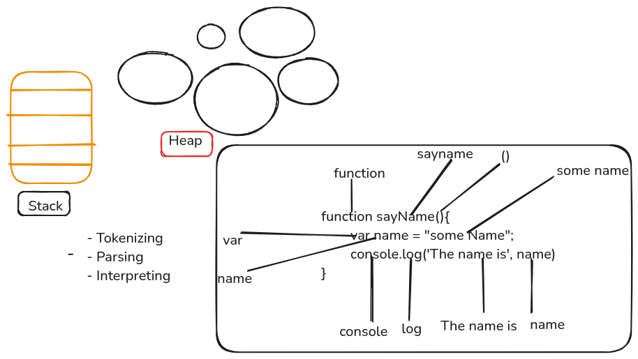

# 🚀 40 Days of JavaScript  
## 📅 Day 02 - Data Types & Variables

<p align="center">

</p>

---

## 📖 Introduction

On Day 02, we learned about the fundamentals of JavaScript data types and variables.  
These concepts are the building blocks of any JavaScript program.

---

## 🧠 JavaScript Data Types

### 🔹 Primitive Data Types

- String → "Hello"
- Number → 25, 39
- Boolean → true / false
- Undefined → variable declared but not assigned
- Null → empty value
- Symbol → unique identifier
- BigInt → large numbers

```js
console.log("data type");